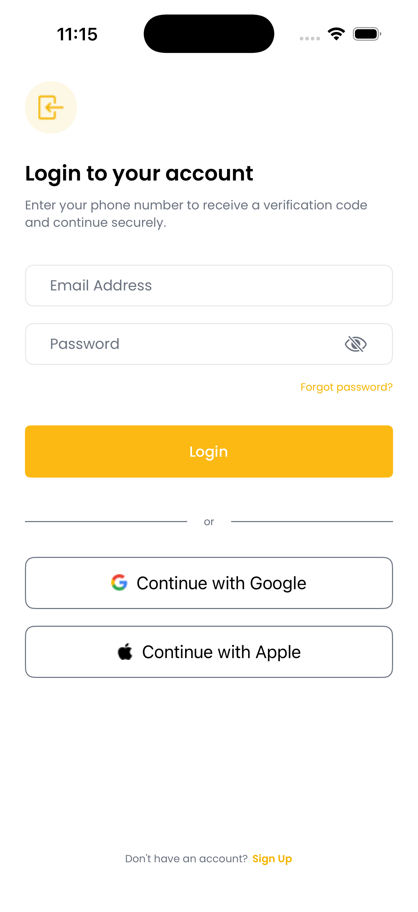
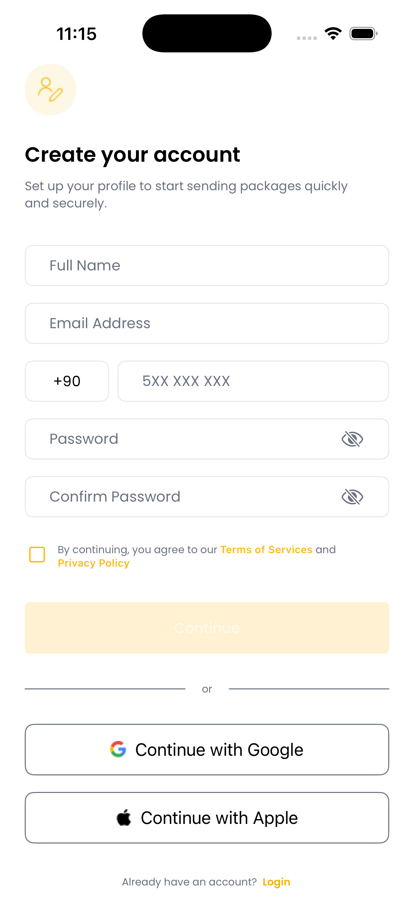

# 📦 Kuryem

> Kurye ve teslimat yönetim platformu — Firebase tabanlı güvenli kimlik doğrulama altyapısı üzerine inşa edilmiş iOS uygulaması.


---

## 📱 Ekran Görüntüleri

| Giriş Yap | Kayıt Ol | Şifremi Unuttum |
|:---------:|:--------:|:---------------:|
|  |  |  |

---

## 🔐 Authentication Akışı

Uygulama şu an **kimlik doğrulama (authentication) modülünü** kapsamaktadır. Tüm auth işlemleri Firebase üzerinden yönetilmektedir.

```
┌─────────────┐     ┌──────────────────────┐     ┌─────────────┐
│   Splash /  │────▶│   Auth Controller    │────▶│  Ana Ekran  │
│  Onboarding │     │  (Login / Register)  │     │   (Home)    │
└─────────────┘     └──────────────────────┘     └─────────────┘
                              │   ▲
                       Firebase│   │Token / User
                        Auth   ▼   │
                       ┌──────────────┐
                       │  Firestore   │
                       │  (User Doc)  │
                       └──────────────┘
```

### Desteklenen Auth İşlemleri

| İşlem | Açıklama | Firebase Servisi |
|---|---|---|
| 📧 E-posta / Şifre ile Giriş | Mevcut kullanıcı girişi | `Firebase Authentication` |
| 📝 Kayıt Ol | Yeni kullanıcı oluşturma | `Firebase Authentication` + `Firestore` |
| 🔑 Şifremi Unuttum | Telefon numarası ile şifre sıfırlama | `Firebase Authentication` |
| 🚪 Çıkış Yap | Oturumu sonlandırma | `Firebase Authentication` |
| 👤 Kullanıcı Profili | Kullanıcı bilgilerini saklama | `Cloud Firestore` |

---

## 🏗️ Mimari

Proje, **Clean Architecture** ve **MVVM** deseni üzerine katmanlı bir yapıyla tasarlanmıştır. Her katmanın sorumluluğu net biçimde ayrıştırılmıştır.

```
kuryem/
├── App/
│   ├── Coordinators/
│   ├── DI/
│   │ └── Protocols                 
├── Core/                  
│   ├── Helper/              
│   ├── Localization/          
│   ├── Protocols/          
├── Data/                  
│   ├── Constants/          
│   ├── Mappers/
│   ├── Repositories/
│   ├── Services/
├── Domain/                 
│   ├── Models/
│   ├── Protocols/       
├── Presentation/
│   ├── RoleSelection/
│   ├── Onboarding/           
│   ├── Auth/
│   │   ├── Login/         
│   │   ├── Register/
│   │   └── ForgotPassword/
│   │   └── CreateNewPassword/
│   │   └── Verification/ 
│   ├── Common/            
│   ├──Styles/
├── Extensions/             
└── Resources/          
```

### Katman Sorumlulukları

```
Presentation  ──▶  Domain  ──▶  Data
  (ViewModel)     (UseCase)   (Repository Impl.)
       │               │             │
   UIKit Views     Protokoller   Firebase SDK
```

- **Presentation**: ViewModel'lar UI state'ini yönetir, UseCase'leri çağırır
- **Domain**: İş kuralları burada. Framework'e bağımlı değil, test edilebilir
- **Data**: Firebase ile gerçek iletişimi sağlar, Domain protokollerini implemente eder

---

## 🛠️ Teknoloji Stack'i

| Kategori | Teknoloji | Amaç |
|---|---|---|
| **UI Framework** | UIKit | Ekranlar ve bileşenler |
| **Dil** | Swift 6.3 | — |
| **Authentication** | Firebase Authentication | E-posta/şifre ile giriş, kayıt, şifre sıfırlama |
| **Veritabanı** | Cloud Firestore | Kullanıcı profili ve uygulama verisi |
| **Mimari** | MVVM + Clean Architecture | Katmanlı, test edilebilir yapı |
| **Platform** | iOS 15+ | — |

---

## 🔥 Firebase Yapılandırması

### Kullanılan Servisler

#### 1. Firebase Authentication
- E-posta & şifre tabanlı kimlik doğrulama
- Oturum yönetimi
- Şifre sıfırlama telefon numarasına gönderimi

#### 2. Cloud Firestore

Kullanıcı kayıt olduğunda Firestore'da aşağıdaki yapıda bir doküman oluşturulur:

```
users (collection)
  └── {uid} (document)
        ├── uid: String
        ├── email: String
        ├── fullName: String
        ├── role: String         // "sender" | "courier"
        ├── createdAt: Timestamp
```
---

## 🚀 Kurulum

### Adım 1 — Repoyu klonla

```bash
git clone https://github.com/furkanfatihkok/kuryem.git
cd kuryem
```

### Adım 2 — Bağımlılıkları yükle

**CocoaPods kullanıyorsan:**
```bash
pod install
open kuryem.xcworkspace   # .xcodeproj değil, .xcworkspace aç!
```

**Swift Package Manager kullanıyorsan:**
> Xcode → File → Add Package Dependencies → Firebase iOS SDK ekle

### Adım 3 — Firebase yapılandırması

1. [Firebase Console](https://console.firebase.google.com)'a git
2. Yeni proje oluştur ya da mevcut projeyi seç
3. iOS uygulaması ekle → Bundle ID: `com.furkanfatihkok.kuryem`
4. `GoogleService-Info.plist` dosyasını indir
5. Dosyayı projenin kök dizinine sürükle & bırak (**Copy if needed** ✅)

### Adım 4 — Firebase Console ayarları

- **Authentication** → Sign-in method → **Email/Password** → Enable
- **Firestore Database** → Create database → Production mode

### Adım 5 — Çalıştır

```bash
# Xcode üzerinden
⌘ + R
```

---

## 🧩 Use Case'ler

```swift
// Giriş
LoginUseCase.execute(email: String, password: String) -> Result<User, Error>

// Kayıt
RegisterUseCase.execute(email: String, password: String, name: String) -> Result<User, Error>

// Şifremi Unuttum
ForgotPasswordUseCase.execute(phone: String) -> Result<Void, Error>
```

---

## 🧪 Testler

```
kuryemTests/     # Unit testler — ViewModel & UseCase testleri
kuryemUITests/   # UI testler — Auth flow end-to-end testleri
```

```bash
# Xcode üzerinden tüm testleri çalıştır
⌘ + U
```

**Test edilmesi önerilen senaryolar:**

- ✅ Geçerli e-posta & şifre ile başarılı giriş
- ✅ Hatalı şifre ile giriş → hata mesajı gösterimi
- ✅ Boş alan validasyonu
- ✅ Kayıt sırasında Firestore'a yazma
- ✅ Şifre sıfırlama e-postası gönderimi

---

## 🗺️ Roadmap

- [x] Firebase Authentication entegrasyonu
- [x] Kullanıcı kaydı & Firestore'a yazma
- [x] Şifre sıfırlama
- [ ] Sipariş oluşturma & listeleme
- [ ] Gerçek zamanlı kurye takibi
- [ ] Push Notification entegrasyonu
- [ ] Kurye / Müşteri rol yönetimi

---

## 👤 Geliştirici

**Furkan Fatih Kok**

[](https://github.com/furkanfatihkok)

---
```
